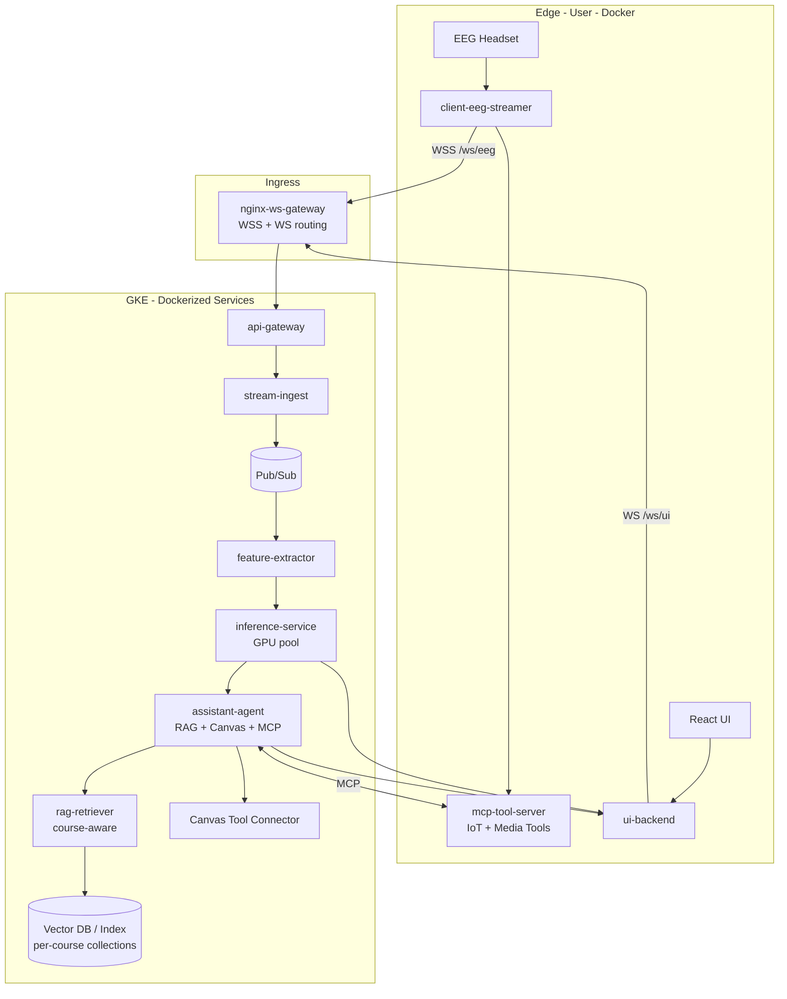
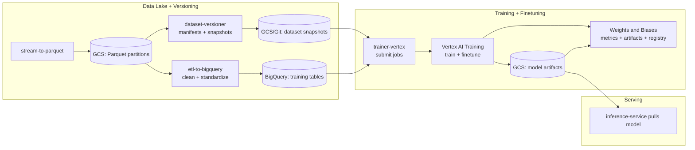
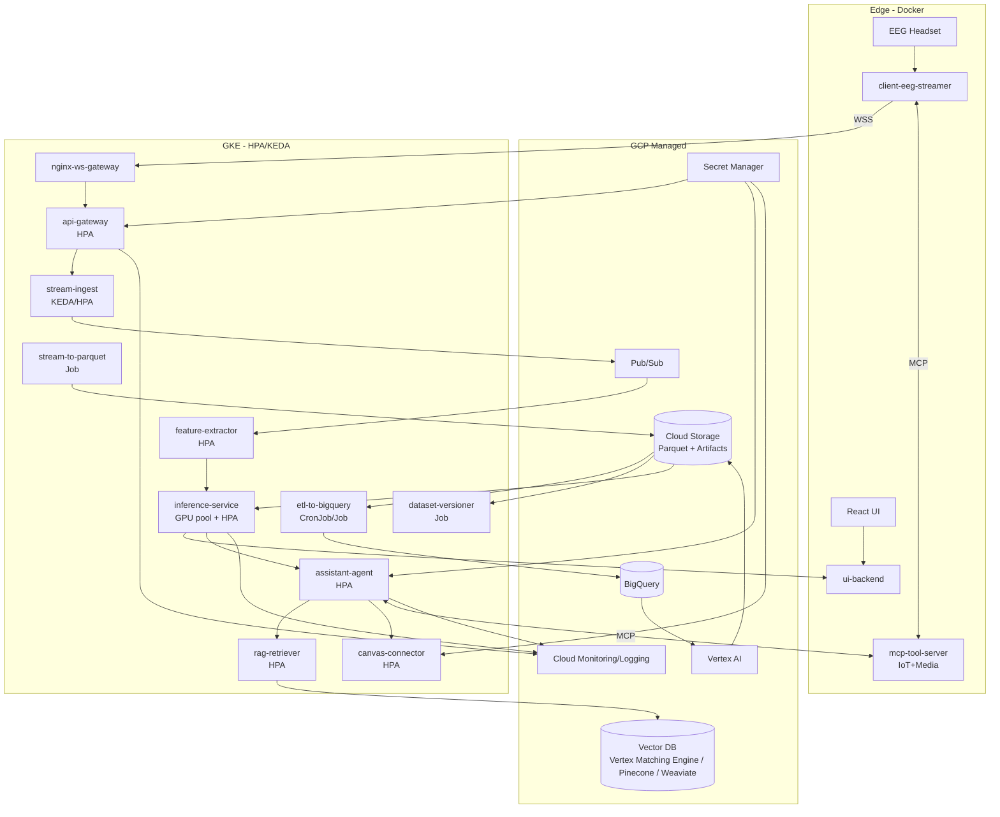

## System Architecture



## Training Architecture




### Key interfaces (so engineering stays crisp)

#### Edge → Cloud

- Protocol: WebSockets or gRPC streaming

- Payload: {session_id, timestamp, channel_samples[], sampling_rate, impedance?, quality_flags}

#### Cloud → UI

- Streaming: WebSocket

- Payload: {text, confidence, token_timestamps, is_command?, tool_results?}

#### Inference boundary

- Feature windowing: e.g., 250–1000 ms windows, sliding stride

- Output rate: ~2–5 Hz "partial decode" updates + finalized tokens

---
# Deployment 

## 1 - Deployment Diagram (GCP + GKE + Autoscaling + RAG + Canvas)


## GitHub Actions Workflow (High-Level)

```yaml
name: ci

on:
  pull_request:
  push:
    branches: [main]

jobs:
  test:
    runs-on: ubuntu-latest
    steps:
      - uses: actions/checkout@v4
      - name: Build containers
        run: docker compose build
      - name: Run unit tests
        run: docker compose run tests
      - name: Run integration tests
        run: docker compose run integration-tests
      - name: Coverage check
        run: ./scripts/check_coverage.sh

  build-and-push:
    needs: test
    if: github.ref == 'refs/heads/main'
    runs-on: ubuntu-latest
    steps:
      - name: Build & push images
        run: ./scripts/build_and_push.sh

```

